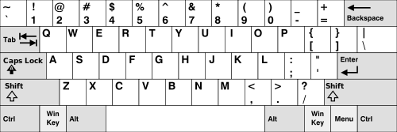
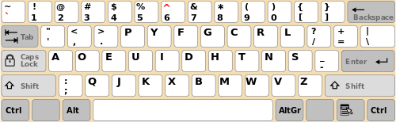

Internationalize your game controls
===================================

Recently two lovely graphical demos were published, where controls wasn't
working on my french AZERTY keyboard.

There was the wonderful WebGL 2 technological demo [After The
Flood](https://playcanv.as/e/p/44MRmJRU/), and the very cute [Alpaca
Peck](http://codepen.io/shshaw/full/apwMwM/). Shaw was nice enough to fix the
latter when I told him about the issue. It turns out our lovely Web Browsers
actually expose a useful API for this.

Let's dig a little bit into the problem we have.


One keyboard, many layouts
--------------------------
I'm sure you know this already, but maybe you never took the time to really
understand what it means: people around the world use different keyboard
layouts. You can read a lot on [Wikipedia's dedicated
page](https://en.wikipedia.org/wiki/Keyboard_layout), but I'll try to
summarise the important bits here.

The best-known and most used layout is QWERTY, used in most of the world.

<br>
_A QWERTY keyboard (source: [Wikipedia](https://commons.wikimedia.org/wiki/File:KB_United_States-NoAltGr.svg))_

But AZERTY is also used a lot in some french-speaking countries.

<br>
_A AZERTY keyboard (source: [Wikipedia](https://commons.wikimedia.org/wiki/File:Clavier-Azerty-France.svg))_

As well as QWERTZ in Germany and other european countries, and DVORAK
as an alternative to QWERTY.

<br>
_A DVORAK keyboard (source: [Wikipedia](https://commons.wikimedia.org/wiki/File:Clavier-Dvorak.svg))_

All these layouts also have variants, especially in the symbols in the top bar,
or the rightmost keys. Two QWERTY keyboards might not be exactly the same. For
example spanish keyboards have a special key for _ñ_, and german keyboards have
special keys for _ä_ and _ö_.

<br>
_A german QWERTZ keyboard (source: [Wikipedia](https://commons.wikimedia.org/wiki/File:KB_Germany.svg))_

But what's important to understand is that the keyboards
have the same structure for all layouts. The keys are mostly at the same
place, although can be slightly arranged. This is called the _mechanical
layout_.

So a regional layout will be made of:
* what's physically printed on the physical key; this is called the _visual
    layout_.
* software (driver) mapping the hardware keys to characters; this is called the
    _functional layout_.

This also means that we can actually _change the layout used in the operating
system without changing the physical keyboard_. They are two different things.
Some users will install
[improved](http://users.sfr.be/denis.liegeois/kbdfrac.htm) [layout](https://github.com/fabi1cazenave/qwerty-lafayette)
[drivers](http://marin.jb.free.fr/qwerty-fr/) to be able to type faster or
more easily some characters. This is especially useful when some useful
characters are not normally available on the layout. For example, to type in
French I can very easily reach _É_, _È_, _Ç_ or the french quotes _«_ and _»_
thanks to the driver I'm using.

But it comes also handy when you need to write text in several languages: I
don't have the _ø_ character anywhere on my keyboard but my driver allows me to
type it easily.

What happens on the Web?
------------------------
Well, to be completely honest with you, [it used to be a complete
mess](http://unixpapa.com/js/key.html). Then we converged to a (somewhat)
cross-browser behavior appropriate for QWERTY keyboards.

The API we've been used to know revolves around the three events `keydown`,
`keypress`, and `keyup`. `keydown` and `keyup` are called _key events_ because
they are fired each time a user press any key, while `keypress` is called a
_character event_ because it's supposed to be fired when a _character_ is sent
as a result of the key press. All modern browsers seem to agree on this, even if
it wasn't always the case.

For this legacy API, we use the three properties of `KeyboardEvent` `keyCode`,
`charCode` and `which`. I won't enter much into the details here, please believe
me when I tell you this is a nightmare to work with:
* they don't have the same meaning whether we're handling a key event
    (`keydown` or `keyup`) or a character event (`keypress`).
* for some keys and events the values are not cross-browser, even for the latest
    versions.
* `keyCode` on key events tries to be international-friendly — no, really — but
    it fails miserably, because of the lack of a common specification.

So let's see what the new API brings us!

The new API, part of UI Events
------------------------------
UI Events, formerly known as DOM Level 3 Events, is a W3C specification in
discussion since 2000. It's still being discussed as a Working Draft, but
because most browsers seem to agree today, we can hope that the specification
will move forward to a recommendation. [Latest working draft is available on
line](https://w3c.github.io/uievents/#events-keyboardevents) as is [latest published
version](https://www.w3.org/TR/uievents/#https://www.w3.org/TR/uievents/#events-keyboardevents).

The new API brings two new very useful properties to a `KeyboardEvent` event:
`key` and `code`. They replace the previously existing (and _still_ existing)
`charCode`, `keyCode`, and `which`.

Let's see why they are so useful, especially to do cross-keyboard websites (if
you allow me this neologism).

### `KeyboardEvent.key` gives you a printable character or a describing string

The property `key` is almost a direct replacement to the previous existing
`which`, except it's a lot more predictable.

In case the pressed key is a printable character you'll get this character in
string form (instead of its ASCII/Windows-1252 code for `which` and
`keyCode`, or Unicode code for `charCode`).

In case it's not a printable character (for example: _Backspace_, _Control_, but
also _Enter_ or _Tab_ which _actually_ have printable characters) we get a
multi-character describing string, like `'Backspace'`, `'Control'`, `'Enter'`,
`'Tab'`.

### `KeyboardEvent.code` gives you the physical key

This property is completely new with this specification, although this is what
`keyCode` should have been.

It gives you, in a string form, the physical key that was pressed. When we say
_physical_, we mean it's totally independant of the keyboard layout used at the
moment.

So let's say the user presses the _Q_ key on a QWERTY keyboard. Then
`event.code` gives you `'KeyQ'` while `event.key` gives you `'q'`.

But when a AZERTY keyboard user presses the _A_ key, he also gets `'KeyQ'` as
`event.code`, yet `event.key` contains `'a'`. Because the _A_ key on a AZERTY
keyboard is at the same location as the _Q_ key on a QWERTY keyboard.

As for numbers, the top digit bar yields values like `'Digit1'`, while the
numeric pad yields values like `'Numpad1'`.

Unfortunately it's implemented only in Blink and Firefox so far.

### Cross-browser controls

[The wonderful MDN wiki has a good example about how to control a game using WASD
or arrows](https://developer.mozilla.org/en-US/docs/Web/API/KeyboardEvent/code#Handle_keyboard_events_in_a_game).

But it's not cross-browser, especially it doesn't work on Safari or Internet
Explorer because they don't implement this specification yet (it should come
in next Safari version 10.1 though!).
So let's look at how we can have some cross-browser code.

Of course, where the specification isn't implemented, it won't work properly on
a non-QWERTY keyboard, so it's a good idea to also handle the arrow keys that
always are at the same place everywhere. In this example I also use the numeric
pad and the IJKL keys as they're less likely to be at different locations.

```html
<!doctype html>
<html>
  <head>
    <meta charset='utf-8'>
    <meta name='viewport' content='initial-scale=1'>
    <style>
.board {
  display: flex;

  width: 50em;
  height: 50em;
  background-color: black;
}

.piece {
  flex: none;
  margin: auto; /* initial position is at the center */

  width: 5em;
  height: 5em;

  background-color: yellow;

  transition: transform .2s;
}
    </style>
  </head>
  <body>
    <div class='board'>
      <div class='piece'></div>
    </div>
    <script>

var piece = document.querySelector('.piece');
var pieceLocation = {
  x: 0,
  y: 0
};

window.addEventListener('keydown', function(e) {
  if (e.defaultPrevented) {
    return;
  }

  // We don't want to mess with the browser's shortcuts
  if (e.ctrlKey || e.altKey || e.metaKey || e.shiftKey) {
    return;
  }

  var direction = {
    x: 0,
    y: 0
  };

  // We try to use `code` first because that's the layout-independent property.
  // Then we use `key` because some browsers, notably Internet Explorer and
  // Edge, support it but not `code`. Then we use `keyCode` to support older
  // browsers like Safari, older Internet Explorer and older Chrome.
  switch (e.code || e.key || e.keyCode) {
    case 'KeyW':
    case 'KeyI':
    case 'ArrowUp':
    case 'Numpad8':
    case 38: // keyCode for arrow up
      direction.y = -1;
      break;
    case 'KeyA':
    case 'KeyJ':
    case 'ArrowLeft':
    case 'Numpad4':
    case 37: // keyCode for arrow left
      direction.x = -1;
      break;
    case 'KeyS':
    case 'KeyK':
    case 'ArrowDown':
    case 'Numpad5':
    case 'Numpad2':
    case 40: // keyCode for arrow down
      direction.y = 1;
      break;
    case 'KeyD':
    case 'KeyL':
    case 'ArrowRight':
    case 'Numpad6':
    case 39: // keyCode for arrow right
      direction.x = 1;
      break;
    default:
      return;
  }

  e.preventDefault();
  pieceLocation.x += direction.x;
  pieceLocation.y += direction.y;
  positionPiece();
});

function positionPiece() {
  piece.style.transform = 'translate(' +
      pieceLocation.x + 'em, ' +
      pieceLocation.y + 'em)';
}
    </script>
  </body>
</html>
```

[Try it by yourself](https://julienw.github.io/article-keyboardevent/example1/)!

Other useful things to know about this new API
----------------------------------------------
Without entering into too much detail, let's fly over some other significant
functionalities in the API:

* The `keypress` event is deprecated. Now you should always use `keydown`
    instead. The event `beforeinput` is also planned but isn't supported by any
    stable version of a browser (Chrome Canary has an implementation). The event
    `input` is a higher-level event that is also useful in some situations.
* With the `location` property on `KeyboardEvent`, if a pressed key exists in
    several locations — eg the Shift or Ctrl keys, or the digits —, then you can
    know which one was really used. For example you can know whether the pressed
    key is in the Numlock Keyboard or on the digit top bar.
    Note that this information is also contained
    in the `code` property, as every physical key gets its own `code`.
* The `repeat` property is set to `true` if the user kept a key depressed and a
    event was sent repeatidly as a result.
* If you want to know if a modifier key is depressed while handling another key's
    `KeyboardEvent`, you don't need to keep track of the state yourself. The
    boolean properties `altKey`, `ctrlKey`, `metaKey`, `shiftKey` as well as the
    method [getModifierState](https://developer.mozilla.org/en-US/docs/Web/API/KeyboardEvent/getModifierState)
    can give you the state of various modifier keys when the event was
    triggered.

Funny enough, the keyboard events don't seem to work properly on mobile
platforms (iPhone untested). So take care to have a touch interface as well!

You can use it now
------------------
This will be my conclusion: you can use this __now__. It's possible to
progressively enhance your control code by taking advantage of the newer API for
modern browsers while supporting older browsers in the same time.

Your international users will thank you for this... by using your product :-)
